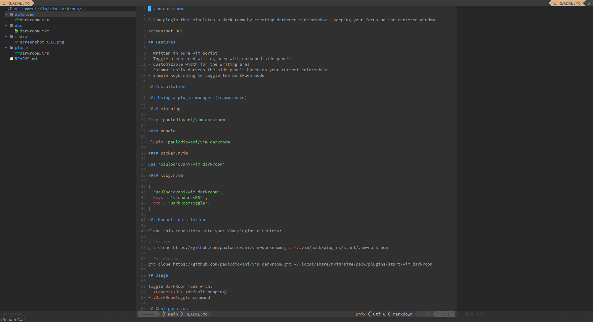

# vim-darkroom

A Neovim plugin that simulates a dark room by creating darkened side windows, keeping your focus on the centered window.



Vim users should install [paulodiovani/vim-darkroom](https://github.com/paulodiovani/vim-darkroom) instead.

## Features

Written in pure Lua

- Toggle a centered writing area with darkened side panels
- Automatically darkens the side panels based on your current colorscheme
- Run Vim commands in side windows (file explorer, terminal, etc.)

## Installation

### Using a plugin manager (recommended)

#### [vim-plug](https://github.com/junegunn/vim-plug)

```vim
Plug 'paulodiovani/darkroom.nvim'
```

#### [Vundle](https://github.com/VundleVim/Vundle.vim)

```vim
Plugin 'paulodiovani/darkroom.nvim'
```

#### [packer.nvim](https://github.com/wbthomason/packer.nvim)

```lua
use {
  'paulodiovani/darkroom.nvim',
  config = function()
    require('darkroom').setup()
  end
}
```

#### [lazy.nvim](https://github.com/folke/lazy.nvim)

```lua
{
  'paulodiovani/darkroom.nvim',
  keys = '<Leader><BS>',
  cmd = 'DarkRoomToggle',
  config = true,
}
```

### Manual installation

Clone this repository into your Vim plugins directory:

```bash
# For Neovim
git clone https://github.com/paulodiovani/darkroom.nvim.git ~/.local/share/nvim/site/pack/plugins/start/darkroom.nvim
```

## Usage

Toggle DarkRoom mode with:
- `<Leader><BS>` (default mapping)
- `:DarkRoomToggle` command

Execute commands in side panels:
- `:DarkRoomLeft {cmd}` - Run command in left panel
- `:DarkRoomRight {cmd}` - Run command in right panel
- `:DarkRoomReplaceLeft {cmd}` - Replace left darkroom window with a Vim command
- `:DarkRoomReplaceRight {cmd}` - Replace right darkroom window with a Vim command

Examples:

```vim
" Show file explorer in left panel
:DarkRoomLeft Explore

" Show help in right panel
:DarkRoomRight help darkroom

" Replace left panel with terminal
:DarkRoomReplaceLeft terminal
```

## Configuration

Add the following settings to your `init.lua` to customize the plugin's behavior.
Default values are shown below.

```lua
require('darkroom').setup({
  -- Buffer name used in DarkRoom side windows
  bufname = '__darkroom__',

  -- Highlight group name for darkroom windows
  highlight = 'DarkRoomNormal',

  -- Percent to darken the background color in side windows (0-100)
  darken_percent = 25,

  -- Minimum number of columns for the main/center window
  min_columns = 130,

  -- Window parameters for side panels
  win_params = {
    buftype = 'nofile',
    filetype = 'darkroom',
    bufhidden = 'wipe',
    modifiable = false,
    buflisted = false,
    swapfile = false,
  }
```

### Recommended Vim Settings

For optimal DarkRoom behavior, it's recommended to disable 'equalalways' option in your Neovim configuration:

```lua
vim.opt.equalalways = false
```

This prevents Vim from automatically equalizing window sizes when DarkRoom is active.
