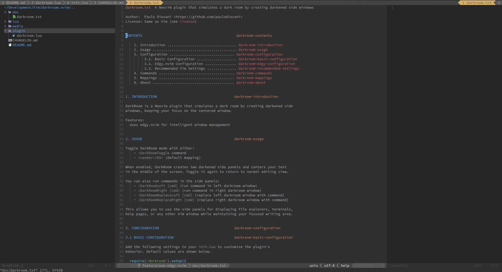

# darkroom.nvim

A Neovim plugin that simulates a dark room by creating darkened side windows, keeping your focus on the centered window.



Vim users should install [vim-darkroom](https://github.com/paulodiovani/vim-darkroom) instead.

## Features

Written in pure Lua

Uses [edgy.nvim](https://github.com/folke/edgy.nvim) for intelligent window management

## Installation

### Using [lazy.nvim](https://github.com/folke/lazy.nvim) (recommended)

```lua
{
  'paulodiovani/darkroom.nvim',
  keys = '<Leader><BS>',
  cmd = 'DarkRoomToggle',
  config = true,
  dependencies = {
    'folke/edgy.nvim',
  }
}
```

### Manual installation

Clone this repository into your Vim plugins directory:

```bash
git clone https://github.com/paulodiovani/darkroom.nvim.git ~/.local/share/nvim/pack/plugins/start/darkroom.nvim
```

Setup in your `config.lua`.

```lua
require('darkroom').setup()
```

Note: You'll also need to install [edgy.nvim](https://github.com/folke/edgy.nvim) as a dependency.

## Usage

Toggle DarkRoom mode:

- `:DarkRoomToggle`
- `<Leader><BS>` (default mapping)

Execute commands in side panels:

- `:DarkRoomLeft [cmd]` (run command in left darkroom window)
- `:DarkRoomRight [cmd]` (run command in right darkroom window)
- `:DarkRoomReplaceLeft [cmd]` (replace left darkroom window with command)
- `:DarkRoomReplaceRight [cmd]` (replace right darkroom window with command)

Examples:

```vim
" Show file explorer in left panel
:DarkRoomLeft Explore

" Replace left panel with terminal
:DarkRoomReplaceLeft terminal

" Show help replacing right panel
:DarkRoomReplaceRight help darkroom
```

## Configuration

Add the following settings to your `init.lua` to customize the plugin's behavior.
Default values are shown below.

```lua
require('darkroom').setup({
  -- Percent to darken the background color in side windows (0-100)
  darken_percent = 25,

  -- Minimum number of columns for the main/center window
  min_columns = 130,

  -- Left window options
  left = {
    filetype = "darkroomleft", -- darkroom window filetype
    additional_filetypes = {   -- additional filetypes to use darkroom
      -- Add any filetypes you want to be handled as darkroom left windows
    },
  },

  -- Right window options
  right = {
    filetype = "darkroomright", -- darkroom window filetype
    additional_filetypes = {    -- additional filetypes to use darkroom
      -- Add any filetypes you want to be handled as darkroom right windows
    },
  },

  -- Window options used in darkroom left/right windows
  wo = {
    winbar = false,                                                -- do not show winbar
    winhighlight = "Normal:DarkRoomNormal,NormalNC:DarkRoomNormal" -- window highlight used by darkroom
  },

  -- Setup edgy.nvim automatically
  -- set to false if you want to configure edgy yourself
  setup_edgy = true
})
```

### Using custom edgy.nvim configuration

If you prefer to configure edgy.nvim yourself, set `setup_edgy = false` in your setup:

```lua
require('darkroom').setup({
  -- Your darkroom configuration...
  setup_edgy = false
})

-- Then configure edgy separately, including darkroom configuration
require('edgy').setup({
  -- Your edgy configuration...
  left = {
    -- Include darkroom windows in your edgy config
    {
      ft = "darkroomleft",
      size = { width = function() return require('darkroom').get_darkroom_width() end },
      -- your edgy options...
    },
    -- Other left windows...
  },
  right = {
    -- Include darkroom windows in your edgy config
    {
      ft = "darkroomright",
      size = { width = function() return require('darkroom').get_darkroom_width() end },
      -- your edgy options...
    },
    -- Other right windows...
  }
})
```

### Recommended Vim Settings

For optimal DarkRoom behavior, it's recommended to disable 'equalalways' option in your Neovim configuration. This prevents Neovim from automatically equalizing window sizes when DarkRoom is active.

#### `equalalways`

```lua
vim.opt.equalalways = false
```

#### `fillchars`

You might also want to remove the vertical window separator.

```lua
vim.opt.fillchars:append({ vert = ' ' })
```
